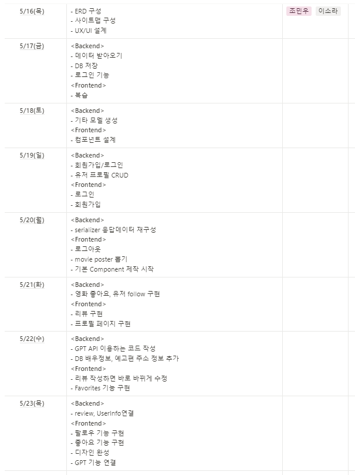
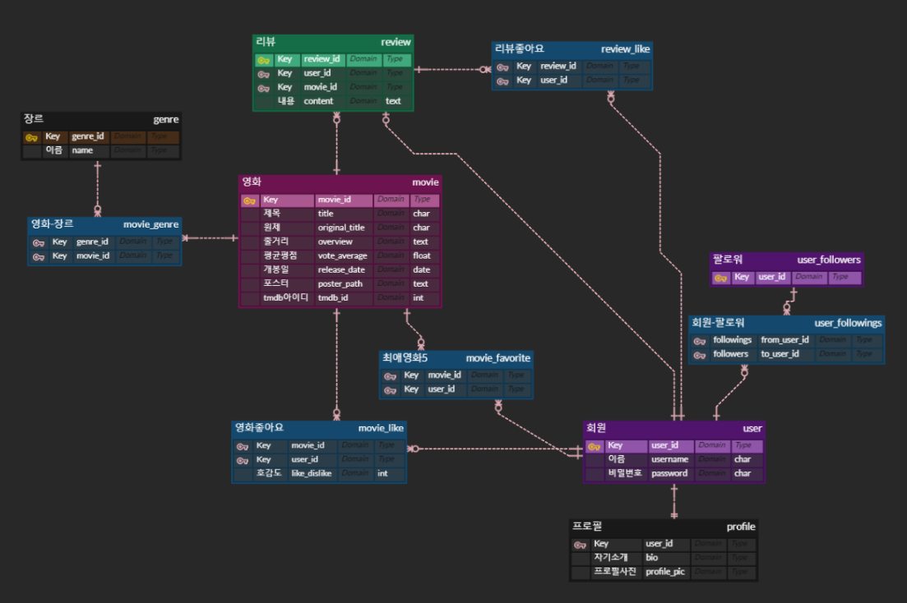

# final_PJT_movie_recommendation

## 1. 팀원 정보 및 업무 분담 내역



## 2. 목표 서비스 구현 및 실제 구현 정도

#### 사용자가 좋아하는 영화를 기반으로 비슷한 영화 추천
- 좋아요를 누른 데이터를 기반으로 GPT가 사용자에게 영화를 추천
- 사용자의 데이터가 많아질 수록 추천 데이터가 정확해질 것으로 기대

#### 사용자 간 팔로우와 프로필 기능
- 팔로우한 사람의 favorite 영화와 좋아요 누른 영화를 확인 할 수 있음
- 리뷰 등을 통해 소통할 수 있음

## 3. 데이터베이스 모델링 (ERD)


## 4. 영화 추천 알고리즘에 대한 기술적 설명
chat-GPT API를 이용하여 사용자가 좋아한 영화와 비슷한 영화를 추천

```python

# user_pk로 사용자가 좋아한 영화를 조회하고 예외처리
def recommend(request, user_pk):
    try:
        user = get_user_model().objects.get(pk=user_pk)
    except get_user_model().DoesNotExist:
        return JsonResponse({'error': 'User not found.'}, status=404)

    liked_movies = user.like_movies.all()
    print(liked_movies)
    if not liked_movies.exists():
        return JsonResponse({'error': 'No liked movies found for the user.'}, status=400)

    liked_movie_titles = [movie.original_title for movie in liked_movies]
    prompt = generate_prompt(liked_movie_titles)
    # GPT에게 전달할 프롬프트 생성

    response = openai.ChatCompletion.create(
        model="gpt-4o",
        messages=[
            {"role": "system", "content": "You are a helpful assistant."},
            {"role": "user", "content": prompt},
        ],
        max_tokens=150,
        n=1,
        stop=None,
        temperature=0.7,
    )

    recommendations_text = response.choices[0].message.content.strip()
    recommendations = recommendations_text.split('\n')
    recommendations = [rec.strip() for rec in recommendations if rec.strip()]
    print('recommendations', recommendations)


    # GPT로 추천 받은 영화를 get_tmdb_data로 정보를 가져옴
    tmdb_recommendations = []
    for movie_title in recommendations:
        tmdb_data = get_tmdb_data(movie_title)
        if tmdb_data:
            tmdb_recommendations.append(tmdb_data)

    return JsonResponse({'recommendations': tmdb_recommendations})


# GPT에게 전달할 프롬프트를 생성하는 함수
def generate_prompt(liked_movies):
    liked_movies_str = ", ".join(liked_movies)
    prompt = (
        f"I have enjoyed the following movies: {liked_movies_str}. " +
        "Can you recommend me at least 8 similar movies that I might like? " +
        "Please provide the recommendations only 'title' without number."
    )
    print('prompt', prompt)
    return prompt

# 추천받은 영화의 제목들을 TMDB의 search API로 검색
def get_tmdb_data(movie_title):
    url = f"https://api.themoviedb.org/3/search/movie?language=ko-KR"
    params = {
        'api_key': "047195d71080c8a4198669abf6149129",
        'query': movie_title,
    }
    response = requests.get(url, params=params)
    if response.status_code == 200:
        print(response.json())
        results = response.json().get('results')
        # print("get_tmdb_data의", results)
        if results:
            remake_data = {
                "tmdb_id": results[0].get("id"),
                "title": results[0].get("title"),
                "poster_path": results[0].get("poster_path")
                }
            return remake_data  # 첫번째로 매칭되는 영화의 데이터를 리턴
    return None
```

## 5. 핵심 기능에 대한 설명

다른 유저의 프로필을 통해 favorite과 좋아요 누른 영화를 확인할 수 있고 영화 디테일 페이지에 있는 리뷰 등을 통해 다른 유저의 영화에 대한 감상평을 알 수 있게 했다.

## 6. 기타 (느낀 점, 후기 등)

### 조민우
설계의 중요성을 알고 있었지만 내가 생각한것 이상으로 중요하다는 것을 깨달았다. 코드를 짜면 짤수록 설계만 잘했다면 쉽게 구현했을 것 같다는 생각을 많이 했다. 처음해보는 개발이었고 처음해보는 팀프로젝트였는데 다음에 더 잘할 것 같다는 느낌이 들었다.

### 이소라
기획 단계가 정말로 중요하다는 걸 느꼈다. 좀 더 탄탄하게 기획하고 들어갔다면 지금보다는 더 나은 결과물이 나왔을 거 같아서 두고두고 아쉽다. vue와 django 둘 다 완벽히 알지 못하는 상태에서 얼레벌레 시작하다보니 더 어려웠던것 같다. 처음 해보는 개발 프로젝트라 우여곡절이 많았지만 돌이켜보고나니 back-front의 역할도 조금이나마 구분하게 되었다. 더 열심히 했었어야 하는데 하는 후회가 남는다. 앞으로는 협업툴도 잘 익혀둬야겠다